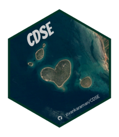

# CDSE <a href="https://zivankaraman.github.io/CDSE/"></a>

**'Copernicus Data Space Ecosystem' API Wrapper**

This package provides the interface to the ['Copernicus Data Space Ecosystem' API](https://dataspace.copernicus.eu/analyse/apis), mainly for searching the catalogue of available data from Copernicus Sentinel missions and obtaining the images for just the area of interest based on selected spectral bands. The package uses the 'Sentinel Hub' RESTful [API interface](https://dataspace.copernicus.eu/analyse/apis/sentinel-hub) to access various satellite imagery archives. It allows you to access raw satellite data, rendered images, statistical analysis, and other features.

This package is in no way officially related to or endorsed by Copernicus.

## Installation

### Stable version

You can install the current stable version of `CDSE` from [CRAN](https://cran.r-project.org/package=CDSE):

``` r
install.packages("CDSE")
```

Windows and macOS binary packages are available from here.

### Development version

You can install the development version of `CDSE` including latest features from [GitHub](https://github.com/zivankaraman/CDSE):

``` r
# install.packages("remotes")
remotes::install_github("zivankaraman/CDSE")
```

## Usage

Access to the 'Copernicus Data Space Ecosystem' is free, but you have to register to get the authentication credentials required to use the API. These necessary steps are explained in detail in the [Before you start](https://zivankaraman.github.io/CDSE/articles/BeforeYouStart.html) article, so please read it first.

Once you have set up your working environment, the [Get started](https://zivankaraman.github.io/CDSE/articles/CDSE.html) will guide you through the main functions and demonstrate how to use the package.

## License

This package is released under [AGPL-3](https://cran.r-project.org/web/licenses/AGPL-3).

## Citation

If you use this package in a publication, I would greatly appreciate it if you cited it. You can get the citation information by typing `citation("CDSE")` in R.

To cite 'CDSE' in publications use:

Karaman Z (2024). CDSE: Copernicus Data Space Ecosystem API Wrapper. [doi:10.32614/CRAN.package.CDSE](https://doi.org/10.32614/CRAN.package.CDSE), <https://zivankaraman.github.io/CDSE/>.

A BibTeX entry for LaTeX users is

@Manual{R-CDSE, title = {{CDSE}: Copernicus Data Space Ecosystem API Wrapper}, doi = {10.32614/CRAN.package.CDSE}, author = {Zivan Karaman}, year = {2024}, version = {0.2.1}, url = {<https://zivankaraman.github.io/CDSE/>}, abstract = {...},}
