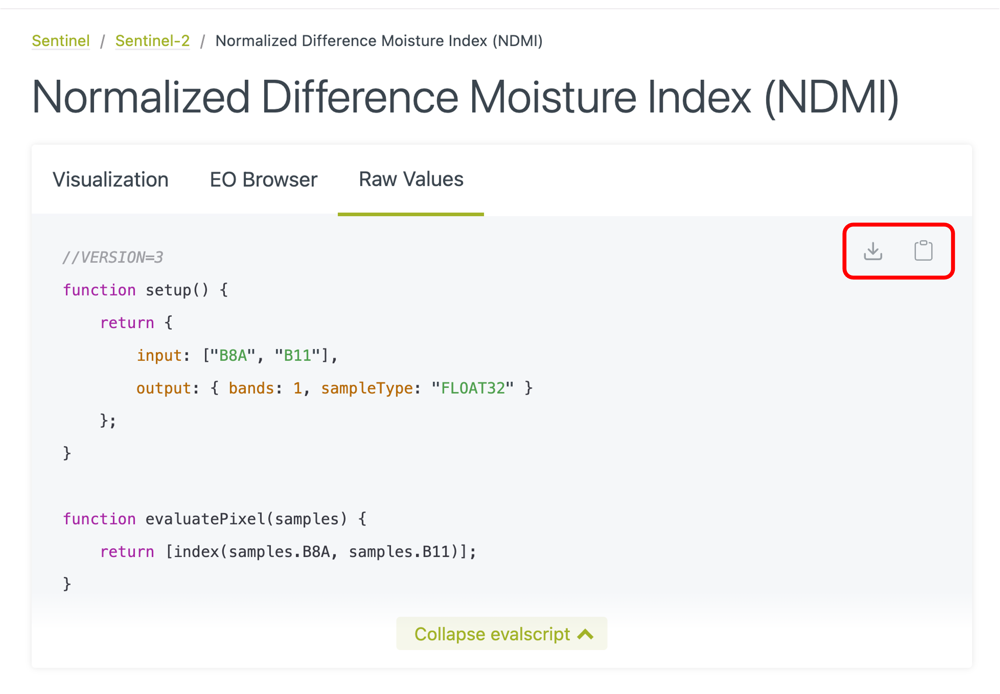
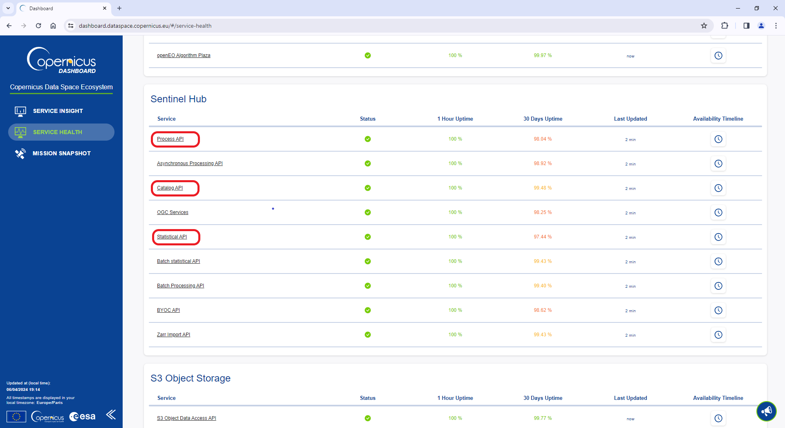

# Using 'Copernicus Data Space Ecosystem' API Wrapper

## Introduction

The `CDSE` package for R was developed to allow access to the
‘[Copernicus Data Space Ecosystem](https://dataspace.copernicus.eu/)’
data and services from R. The `'Copernicus Data Space Ecosystem'`,
deployed in 2023, offers access to the EO data collection from the
Copernicus missions, with discovery and download capabilities and
numerous data processing tools. In particular, the [‘Sentinel Hub’
API](https://documentation.dataspace.copernicus.eu/APIs/SentinelHub.html)
provides access to the multi-spectral and multi-temporal big data
satellite imagery service, capable of fully automated, real-time
processing and distribution of remote sensing data and related EO
products. Users can use APIs to retrieve satellite data over their AOI
and specific time range from full archives in a matter of seconds. When
working on the application of EO where the area of interest is
relatively small compared to the image tiles distributed by Copernicus
(100 x 100 km), it allows to retrieve just the portion of the image of
interest rather than downloading the huge tile image file and processing
it locally. The goal of the `CDSE` package is to provide easy access to
this functionality from R.

The main functions allow to search the catalog of available imagery from
the Sentinel-1, Sentinel-2, Sentinel-3, and Sentinel-5 missions, and to
process and download the images of an area of interest and a time range
in various formats. Other functions might be added in subsequent
releases of the package.

## API authentication

Most of the API functions require OAuth2 authentication. The recommended
procedure is to obtain an authentication client object from the
[`GetOAuthClient()`](https://zivankaraman.github.io/CDSE/reference/GetOAuthClient.md)
function and pass it as the `client` argument to the functions requiring
the authentication. For more detailed information, you are invited to
consult the “`Before you start`” document.

``` r
id <- Sys.getenv("CDSE_ID")
secret <- Sys.getenv("CDSE_SECRET")
OAuthClient <- GetOAuthClient(id = id, secret = secret)
```

## Collections

We can get the list of all the imagery collections available in the
`'Copernicus Data Space Ecosystem'`. By default, the list is formatted
as a data.frame listing the main collection features. It is also
possible to obtain the raw list with all information by setting the
argument `as_data_frame` to `FALSE`.

``` r
collections <- GetCollections(as_data_frame = TRUE)
collections
#>                       id                   title
#> 1         sentinel-2-l1c          Sentinel 2 L1C
#> 2     sentinel-3-olci-l2      Sentinel 3 OLCI L2
#> 3          landsat-ot-l1 Landsat 8-9 OLI-TIRS L1
#> 4        sentinel-3-olci         Sentinel 3 OLCI
#> 5       sentinel-3-slstr        Sentinel 3 SLSTR
#> 6    sentinel-3-slstr-l2     Sentinel 3 SLSTR L2
#> 7  sentinel-3-synergy-l2   Sentinel 3 Synergy L2
#> 8         sentinel-1-grd          Sentinel 1 GRD
#> 9         sentinel-2-l2a          Sentinel 2 L2A
#> 10        sentinel-5p-l2    Sentinel 5 Precursor
#>                                                                     description
#> 1                                      Sentinel 2 imagery processed to level 1C
#> 2                  Sentinel 3 data derived from imagery captured by OLCI sensor
#> 3                         Landsat 8-9 Collection 2 imagery processed to level 1
#> 4                                    Sentinel 3 imagery captured by OLCI sensor
#> 5                                   Sentinel 3 imagery captured by SLSTR sensor
#> 6                 Sentinel 3 data derived from imagery captured by SLSTR sensor
#> 7  Sentinel 3 data derived from imagery captured by both OLCI and SLSTR sensors
#> 8                                      Sentinel 1 Ground Range Detected Imagery
#> 9                                      Sentinel 2 imagery processed to level 2A
#> 10                      Sentinel 5 Precursor imagery captured by TROPOMI sensor
#>                   since            instrument  gsd bands constellation long.min
#> 1  2015-11-01T00:00:00Z                   msi   10    13    sentinel-2     -180
#> 2  2016-04-17T11:33:13Z                  olci  300    NA          <NA>     -180
#> 3  2013-03-08T00:00:00Z oli/tirs/oli-2/tirs-2   30    17          <NA>     -180
#> 4  2016-04-17T11:33:13Z                  olci  300    21          <NA>     -180
#> 5  2016-04-17T11:33:13Z                 slstr 1000    11          <NA>     -180
#> 6  2016-04-17T11:33:13Z                 slstr 1000    NA          <NA>     -180
#> 7  2016-04-17T11:33:13Z            olci/slstr  300    NA          <NA>     -180
#> 8  2014-10-03T00:00:00Z                 c-sar   NA    NA    sentinel-1     -180
#> 9  2016-11-01T00:00:00Z                   msi   10    12    sentinel-2     -180
#> 10 2018-04-30T00:18:50Z               tropomi 5500    NA          <NA>     -180
#>    lat.min long.max lat.max
#> 1      -56      180      83
#> 2      -85      180      85
#> 3      -85      180      85
#> 4      -85      180      85
#> 5      -85      180      85
#> 6      -85      180      85
#> 7      -85      180      85
#> 8      -85      180      85
#> 9      -56      180      83
#> 10     -85      180      85
```

## Catalog search

The imagery catalog can be searched by spatial and temporal extent for
every collection present in the `'Copernicus Data Space Ecosystem'`. For
the spatial filter, you can provide either a `sf` or `sfc` object from
the `sf` package, typically a (multi)polygon, describing the Area of
Interest, or a numeric vector of four elements describing the bounding
box of interest. For the temporal filter, you must specify the time
range by either `Date` or `character` values that can be converted to
date by `as.Date` function. Open intervals (one side only) can be
obtained by providing the `NA` or `NULL` value for the corresponding
argument.

``` r
dsn <- system.file("extdata", "luxembourg.geojson", package = "CDSE")
aoi <- sf::read_sf(dsn, as_tibble = FALSE)
images <- SearchCatalog(aoi = aoi, from = "2023-07-01", to = "2023-07-31", 
    collection = "sentinel-2-l2a", with_geometry = TRUE, client = OAuthClient)
images
#> Simple feature collection with 70 features and 11 fields
#> Geometry type: POLYGON
#> Dimension:     XY
#> Bounding box:  xmin: 4.357925 ymin: 48.58836 xmax: 7.775117 ymax: 50.54532
#> Geodetic CRS:  WGS 84
#> First 10 features:
#>    acquisitionDate tileCloudCover areaCoverage   satellite
#> 1       2023-07-31          98.87        1.845 sentinel-2a
#> 2       2023-07-31          99.85       20.346 sentinel-2a
#> 3       2023-07-31          99.74        5.934 sentinel-2a
#> 4       2023-07-31          99.94       16.324 sentinel-2a
#> 5       2023-07-31          99.91       92.463 sentinel-2a
#> 6       2023-07-31          99.41       22.236 sentinel-2a
#> 7       2023-07-28          99.99        4.986 sentinel-2a
#> 8       2023-07-28          99.99        5.659 sentinel-2a
#> 9       2023-07-28          99.99        4.294 sentinel-2a
#> 10      2023-07-28          99.92        4.944 sentinel-2a
#>    acquisitionTimestampUTC acquisitionTimestampLocal
#> 1      2023-07-31 10:47:29       2023-07-31 12:47:29
#> 2      2023-07-31 10:47:25       2023-07-31 12:47:25
#> 3      2023-07-31 10:47:22       2023-07-31 12:47:22
#> 4      2023-07-31 10:47:14       2023-07-31 12:47:14
#> 5      2023-07-31 10:47:11       2023-07-31 12:47:11
#> 6      2023-07-31 10:47:09       2023-07-31 12:47:09
#> 7      2023-07-28 10:37:28       2023-07-28 12:37:28
#> 8      2023-07-28 10:37:27       2023-07-28 12:37:27
#> 9      2023-07-28 10:37:21       2023-07-28 12:37:21
#> 10     2023-07-28 10:37:20       2023-07-28 12:37:20
#>                                                             sourceId long.min
#> 1  S2A_MSIL2A_20230731T103631_N0510_R008_T31UFQ_20241021T055741.SAFE 4.357925
#> 2  S2A_MSIL2A_20230731T103631_N0510_R008_T31UGQ_20241021T055741.SAFE 5.714101
#> 3  S2A_MSIL2A_20230731T103631_N0510_R008_T32ULV_20241021T055741.SAFE 6.230946
#> 4  S2A_MSIL2A_20230731T103631_N0510_R008_T31UFR_20241021T055741.SAFE 4.382698
#> 5  S2A_MSIL2A_20230731T103631_N0510_R008_T31UGR_20241021T055741.SAFE 5.763559
#> 6  S2A_MSIL2A_20230731T103631_N0510_R008_T32ULA_20241021T055741.SAFE 6.178682
#> 7  S2A_MSIL2A_20230728T102601_N0510_R108_T31UGQ_20241020T071602.SAFE 5.880056
#> 8  S2A_MSIL2A_20230728T102601_N0510_R108_T32ULV_20241020T071602.SAFE 6.234494
#> 9  S2A_MSIL2A_20230728T102601_N0510_R108_T31UGQ_20241020T040431.SAFE 6.218396
#> 10 S2A_MSIL2A_20230728T102601_N0510_R108_T32ULV_20241020T040431.SAFE 6.235763
#>     lat.min long.max  lat.max                       geometry
#> 1  48.62983 5.904558 49.64443 POLYGON ((4.385187 49.64443...
#> 2  48.58836 7.285031 49.61960 POLYGON ((5.768528 49.6196,...
#> 3  48.63394 7.762836 49.64597 POLYGON ((6.230946 49.61959...
#> 4  49.52843 5.959371 50.54373 POLYGON ((4.411363 50.54373...
#> 5  49.48563 7.365728 50.51810 POLYGON ((5.820783 50.5181,...
#> 6  49.53174 7.752769 50.54532 POLYGON ((6.178682 50.51809...
#> 7  48.58836 7.281682 49.60696 POLYGON ((6.254039 49.60696...
#> 8  48.63304 7.775117 49.62896 POLYGON ((6.259211 49.62026...
#> 9  49.36204 7.285031 49.60696 POLYGON ((6.254038 49.60696...
#> 10 49.27949 7.759809 49.64597 POLYGON ((6.259212 49.62026...
```

We can visualize the coverage of the area of interest by the satellite
image tiles by plotting the footprints of the available images and
showing the region of interest in red.

``` r
library(maps)
days <- range(as.Date(images$acquisitionDate))
maps::map(database = "world", col = "lightgrey", fill = TRUE, mar = c(0, 0, 4, 0),
    xlim = c(3, 9), ylim = c(47.5, 51.5))
plot(sf::st_geometry(aoi), add = TRUE, col = "red", border = FALSE)
plot(sf::st_geometry(images), add = TRUE)
title(main = sprintf("AOI coverage by image tiles for period %s", 
    paste(days, collapse = " / ")), line = 1L, cex.main = 0.75)
```


Luxembourg image tiles coverage

Some tiles cover only a small fraction of the area of interest, while
others cover almost the entire area.

``` r
summary(images$areaCoverage)
#>    Min. 1st Qu.  Median    Mean 3rd Qu.    Max. 
#>   1.845   5.603  15.115  19.758  20.346  92.463
```

The tile number can be obtained from the image attribute `sourceId`, as
explained [here](https://sentiwiki.copernicus.eu/web/s2-products). We
can therefore summarize the distribution of area coverage by tile
number, and see which tiles provide the best coverage of the AOI.

``` r
tileNumber <- substring(images$sourceId, 39, 44)
by(images$areaCoverage, INDICES = tileNumber, FUN = summary)
#> tileNumber: T31UFQ
#>    Min. 1st Qu.  Median    Mean 3rd Qu.    Max. 
#>   1.845   1.845   1.845   1.845   1.845   1.845 
#> ------------------------------------------------------------ 
#> tileNumber: T31UFR
#>    Min. 1st Qu.  Median    Mean 3rd Qu.    Max. 
#>   16.32   16.32   16.32   16.32   16.32   16.32 
#> ------------------------------------------------------------ 
#> tileNumber: T31UGQ
#>    Min. 1st Qu.  Median    Mean 3rd Qu.    Max. 
#>   4.294   4.910  12.706  12.587  20.346  20.346 
#> ------------------------------------------------------------ 
#> tileNumber: T31UGR
#>    Min. 1st Qu.  Median    Mean 3rd Qu.    Max. 
#>   6.855  15.607  54.299  53.426  92.463  92.463 
#> ------------------------------------------------------------ 
#> tileNumber: T32ULA
#>    Min. 1st Qu.  Median    Mean 3rd Qu.    Max. 
#>   6.171  14.950  18.814  17.972  22.236  22.236 
#> ------------------------------------------------------------ 
#> tileNumber: T32ULV
#>    Min. 1st Qu.  Median    Mean 3rd Qu.    Max. 
#>   4.944   5.603   5.819   5.723   5.934   5.934
```

### Catalog by season

Sometimes one can be interested in only a given period of each year, for
example, the images taken during the summer months (June to August). We
can filter an existing image catalog *a posteriori* using the
[`SeasonalFilter()`](https://zivankaraman.github.io/CDSE/reference/SeasonalFilter.md)
function.

``` r
dsn <- system.file("extdata", "centralpark.geojson", package = "CDSE")
aoi <- sf::read_sf(dsn, as_tibble = FALSE)
images <- SearchCatalog(aoi = aoi, from = "2021-01-01", to = "2023-12-31", 
    collection = "sentinel-2-l2a", with_geometry = FALSE, filter = "eo:cloud_cover < 5", 
    client = OAuthClient)
images <- UniqueCatalog(images, by = "tileCloudCover")
dim(images)
#> [1] 81 10
summer_images <- SeasonalFilter(images, from = "2021-06-01", to = "2023-08-31")
dim(summer_images)
#> [1] 14 10
```

It is also possible to query the API directly on the desired seasonal
periods by using a vectorized version of the
[`SearchCatalog()`](https://zivankaraman.github.io/CDSE/reference/SearchCatalog.md)
function. The vectorized versions allow running a series of queries
having the same parameter values except for either time range, AOI, or
the bounding box parameters, using `lapply` or similar function, and
thus potentially also using the parallel processing.

``` r
dsn <- system.file("extdata", "centralpark.geojson", package = "CDSE")
aoi <- sf::read_sf(dsn, as_tibble = FALSE)
seasons <- SeasonalTimerange(from = "2021-06-01", to = "2023-08-31")
lst_summer_images <- lapply(seasons, SearchCatalogByTimerange, aoi = aoi, 
    collection = "sentinel-2-l2a", filter = "eo:cloud_cover < 5", with_geometry = FALSE, 
    client = OAuthClient)
summer_images <- do.call(rbind, lst_summer_images)
summer_images <- UniqueCatalog(summer_images, by = "tileCloudCover")
dim(summer_images)
#> [1] 14 10
summer_images <- summer_images[rev(order(summer_images$acquisitionDate)), ]
row.names(summer_images) <- NULL
summer_images
#>    acquisitionDate tileCloudCover   satellite acquisitionTimestampUTC
#> 1       2023-08-20           0.00 sentinel-2a     2023-08-20 15:51:57
#> 2       2023-07-31           2.53 sentinel-2a     2023-07-31 15:51:56
#> 3       2023-07-26           0.59 sentinel-2b     2023-07-26 15:51:56
#> 4       2023-07-11           4.38 sentinel-2a     2023-07-11 15:51:56
#> 5       2023-06-01           0.00 sentinel-2a     2023-06-01 15:51:54
#> 6       2022-08-25           1.18 sentinel-2a     2022-08-25 15:52:03
#> 7       2022-08-03           4.58 sentinel-2b     2022-08-03 16:01:51
#> 8       2022-07-19           1.37 sentinel-2a     2022-07-19 16:01:58
#> 9       2022-07-11           4.92 sentinel-2b     2022-07-11 15:51:57
#> 10      2022-06-19           1.91 sentinel-2a     2022-06-19 16:01:58
#> 11      2022-06-06           0.99 sentinel-2a     2022-06-06 15:51:58
#> 12      2022-06-04           2.76 sentinel-2b     2022-06-04 16:01:47
#> 13      2021-06-16           4.74 sentinel-2b     2021-06-16 15:51:51
#> 14      2021-06-06           0.38 sentinel-2b     2021-06-06 15:51:52
#>    acquisitionTimestampLocal
#> 1        2023-08-20 11:51:57
#> 2        2023-07-31 11:51:56
#> 3        2023-07-26 11:51:56
#> 4        2023-07-11 11:51:56
#> 5        2023-06-01 11:51:54
#> 6        2022-08-25 11:52:03
#> 7        2022-08-03 12:01:51
#> 8        2022-07-19 12:01:58
#> 9        2022-07-11 11:51:57
#> 10       2022-06-19 12:01:58
#> 11       2022-06-06 11:51:58
#> 12       2022-06-04 12:01:47
#> 13       2021-06-16 11:51:51
#> 14       2021-06-06 11:51:52
#>                                                             sourceId  long.min
#> 1  S2A_MSIL2A_20230820T153821_N0510_R011_T18TWL_20241015T130941.SAFE -74.89340
#> 2  S2A_MSIL2A_20230731T155141_N0510_R011_T18TWL_20240820T212405.SAFE -74.88632
#> 3  S2B_MSIL2A_20230726T153819_N0510_R011_T18TWL_20240819T050747.SAFE -74.88431
#> 4  S2A_MSIL2A_20230711T153821_N0510_R011_T18TWL_20241019T212830.SAFE -74.88773
#> 5  S2A_MSIL2A_20230601T155141_N0510_R011_T18TWL_20240812T201136.SAFE -74.89199
#> 6  S2A_MSIL2A_20220825T155151_N0510_R011_T18TWL_20240630T134356.SAFE -74.89577
#> 7  S2B_MSIL2A_20220803T154819_N0510_R054_T18TWL_20240715T195039.SAFE -75.00023
#> 8  S2A_MSIL2A_20220719T154951_N0510_R054_T18TWL_20240705T002349.SAFE -75.00023
#> 9  S2B_MSIL2A_20220711T153819_N0510_R011_T18TWL_20240620T183156.SAFE -74.88525
#> 10 S2A_MSIL2A_20220619T154821_N0510_R054_T18TWL_20240701T042207.SAFE -75.00023
#> 11 S2A_MSIL2A_20220606T153821_N0510_R011_T18TWL_20240714T132919.SAFE -74.88136
#> 12 S2B_MSIL2A_20220604T154809_N0510_R054_T18TWL_20240619T142906.SAFE -75.00023
#> 13 S2B_MSIL2A_20210616T153809_N0500_R011_T18TWL_20230131T171455.SAFE -74.88136
#> 14 S2B_MSIL2A_20210606T153809_N0500_R011_T18TWL_20230603T225907.SAFE -74.88277
#>     lat.min  long.max  lat.max
#> 1  40.55548 -73.68381 41.55110
#> 2  40.55548 -73.68381 41.55107
#> 3  40.55548 -73.68381 41.55107
#> 4  40.55548 -73.68381 41.55108
#> 5  40.55548 -73.68381 41.55109
#> 6  40.55548 -73.68381 41.55111
#> 7  40.55820 -73.68381 41.55184
#> 8  40.55819 -73.68381 41.55184
#> 9  40.55550 -73.69200 41.35177
#> 10 40.55681 -73.68381 41.55184
#> 11 40.55548 -73.68381 41.55105
#> 12 40.55781 -73.68381 41.55184
#> 13 40.55548 -73.68381 41.55106
#> 14 40.55548 -73.68381 41.55106
```

## Evalscripts

As we shall see in the examples below, the functions that operate on
remotely sensed spectral band values, such as
[`GetImage()`](https://zivankaraman.github.io/CDSE/reference/GetImage.md)
or
[`GetStatistics()`](https://zivankaraman.github.io/CDSE/reference/GetStatistics.md),
require an evalscript to be passed to the `script` argument.

An evalscript (or “custom script”) is a piece of JavaScript code that
defines how the satellite data shall be processed by the API and what
values the service shall return. It is a required part of any request
involving data processing, such as retrieving an image of the area of
interest or computing some statistical values for a given period of
time.

The evaluation scripts can use any JavaScript function or language
structures, along with certain utility functions provided by the API for
user convenience. The Chrome V8 JavaScript engine is used for running
the evalscripts.

The evaluation scripts are passed as the `script` argument to the
[`GetImage()`](https://zivankaraman.github.io/CDSE/reference/GetImage.md),
[`GetStatistics()`](https://zivankaraman.github.io/CDSE/reference/GetStatistics.md),
and other functions that require an evalscript. It has to be either a
character string containing the evaluation script or the name of the
file containing the script.

Although it is beyond the scope of this document to provide the detailed
guidance for writing evalscripts, we shall provide here some tips that
can help you to use the the above mentioned functions without deep
understanding of the evalscripts’ internal workings. We encourage users
who wish to acquire a deeper knowledge of evalscripts to consult the API
[Beginners
Guide](https://docs.sentinel-hub.com/api/latest/user-guides/beginners-guide/)
and [Evalscript (custom
script)](https://docs.sentinel-hub.com/api/latest/evalscript/)
documentation. You can also find a large collection of custom scripts
that you can readily use in this
[repository](https://custom-scripts.sentinel-hub.com/custom-scripts/sentinel/).

### Built-in scripts

The `scripts` folder of this package contains a few examples of
evaluation scripts. They are very limited, both in number and scope, and
their main purpose is to provide scripts that are used in documentation
and examples. You can, of course, use them as a starting point to
develop your own scripts by applying some relatively simple
modifications (for example, starting from an NDVI script, replacing
bands B04 and B08 with bands B8A and B11 will give a script for the
NDMI - Normalized Difference Moisture Index).

### Ready-to-use examples

There is a large collection of evalscripts that you can readily use
available in this
[repository](https://custom-scripts.sentinel-hub.com/custom-scripts/sentinel/).
The scripts are grouped by satellite constellation (Sentinel-1,
Sentinel-2, …) and application field (Agriculture, Disaster management,
Urban planning, …). To use one of these scripts, the simplest way is
probably to use the “*Download code*” or “*Copy code*” icons in the
upper right corner of the code window (see the illustration below). Some
indices come in several flavours (Visualisation vs. Raw Values); select
the one that corresponds to your situation. If you want to do some
further analysis of the images, use raw values; if you want to simply
display the image, you can use the visualisation version (you will
probably also export the result as a JPEG or PNG file). You can, of
course, always get the raw values and then customise the visualisation
in your R code. Other indices might have only one version; it will
likely first compute the index value and then possibly transform it for
visualisation - adapt based on your needs.



Using evalscript code from the repository

*Note:*

*The repository also contains scripts for satellite collections that are
not available through CDSE.*

  

### Awesome Spectral Indices

‘Awesome Spectral Indices’
([ASI](https://awesome-ee-spectral-indices.readthedocs.io/en/latest/))
is a standardized, machine-readable catalogue of spectral indices used
in remote sensing for Earth Observation. It currently includes over 240
spectral indices grouped into eight application domains: vegetation,
water, burn, snow, soil, urban, radar, and kernel indices. Each spectral
index in ASI comes with a set of attributes such as a short and long
name, application domain, formula, required bands, platforms,
references, date of addition, and contributor information.

The `R` package [rsi](https://cran.r-project.org/package=rsi) implements
an interface to the ASI collection, providing the list of indices
directly in `R` as a friendly `data.frame` (actually a `tibble`). These
indices can now be directly used in the ‘CDSE’ package to provide the
evalscript to the functions that require one. For this purpose, we have
developed the
[`MakeEvalScript()`](https://zivankaraman.github.io/CDSE/reference/MakeEvalScript.md)
function that will generate the script for you based on the information
contained in the `data.frame` of spectral indices produced by
[`rsi::spectral_indices()`](https://permian-global-research.github.io/rsi/reference/spectral_indices.html).

Here is an example showing how it works.

``` r
si <- rsi::spectral_indices() # get spectral indices
# NDVI
ndvi <- subset(si, short_name == "NDVI") # creates one-row data.frame
ndvi_script <- MakeEvalScript(ndvi, constellation = "landsat") # generates the script
# GDVI
gdvi <- subset(si, short_name == "GDVI") # creates one-row data.frame
# GDVI requires an extra argument provided by the user
gdvi_script <- MakeEvalScript(gdvi, nexp = 2, constellation = "sentinel-2")
```

The value returned by the function is a character vector with each
element representing one line of the script. You can best visualise the
script code by `cat(gdvi_script, sep = "\n")`, or save it to a file for
later use with `cat(gdvi_script, file = "GDVI.js", sep = "\n")`. To use
the generated script directly in a function, you would use something
like `GetImage(..., script = paste(gdvi_script, collapse = "\n"), ...)`.

If the package `rsi` is installed, you can use a shortcut and just
provide the `short_name` of the index as the first argument (instead of
the one-row `data.frame`). Please note that the `short_name` is
case-sensitive, although most of the names are in full upper-case. You
of course still have to provide any additional arguments, if required,
in the usual way. Here is an example:

``` r
gdvi_script <- MakeEvalScript("GDVI", nexp = 2, constellation = "sentinel-2")
```

Finally, you can also define ad-hoc custom indices by providing a
one-row `data.frame` crafted after the model produced by
[`rsi::spectral_indices()`](https://permian-global-research.github.io/rsi/reference/spectral_indices.html).
Please ensure that you respect the correct formatting, particularly when
writing the formula. Since the function does not use all the attributes
of spectral indices but just `bands`, `formula`, `platform` and
optionally `long_name` (used as a comment in the header of the script),
you can provide only this information, and it does not even have to be a
`data.frame`, a simple `list` will do.

We shall illustrate this with an example. Since the ASI spectral indices
collection is very rich, rather than recreating an already existing
index or creating a completely dummy ad-hoc index, we shall use a
transformation of an RGB image into a greyscale image, based on
[this](https://github.com/michaeldorman/starsExtra/blob/master/R/rgb_to_greyscale.R)
code, which strictly speaking might not be a spectral index, but can
illustrate the process.

``` r
custom_def <- list(bands = c("R", "G", "B"),
                   formula = "0.3 * R + 0.59 * G + 0.11 * B",
                   # long_name = "Greyscale image",
                   platforms = "Sentinel-2")
custom_script <- paste(MakeEvalScript(custom_def, constellation = "sentinel-2"), 
                       collapse = "\n")
```

We can now compare the greyscale and RGB images.

``` r
# select the day with smallest cloud cover
dsn <- system.file("extdata", "centralpark.geojson", package = "CDSE")
aoi <- sf::read_sf(dsn, as_tibble = FALSE)
images <- SearchCatalog(aoi = aoi, from = "2023-06-01", to = "2023-08-31",
                        collection = "sentinel-2-l2a", with_geometry = TRUE,
                        client = OAuthClient)
day <- images[order(images$tileCloudCover), ][["acquisitionDate"]][1]
# get the greyscale image
grey_file <- file.path(tempdir(), "grey.tif")
GetImage(bbox = sf::st_bbox(aoi), time_range = day, script = custom_script, 
         file = grey_file,
         collection = "sentinel-2-l2a", format = "image/tiff",
         mosaicking_order = "leastCC", resolution = 20,
         mask = FALSE, buffer = 100, client = OAuthClient)
# get the RGB image
script_file <- system.file("scripts", "TrueColorS2L2A.js", package = "CDSE")
rgb_file <- file.path(tempdir(), "rgb.tif")
GetImage(bbox = sf::st_bbox(aoi), time_range = day, script = script_file, 
         file = rgb_file,
         collection = "sentinel-2-l2a", format = "image/tiff",
         mosaicking_order = "leastCC", resolution = 20,
         mask = FALSE, buffer = 100, client = OAuthClient)
# Import the rasters
rgb_img <- terra::rast(rgb_file)
grey_img <- terra::rast(grey_file)
# Rescale greyscale raster values to 0 - 1 range
mM <- terra::minmax(grey_img)
grey_img <- (grey_img - mM[1])/(mM[2] - mM[1])
# Set up plotting window for side-by-side display
old.par <- par(mfrow = c(1, 2))
# Plot RGB image
plotRGB(rgb_img)   # expects layers 1,2,3 as R,G,B
# Plot greyscale image
plot(grey_img, col = grey.colors(256, start = 0, end = 1), legend = FALSE, 
     axes = FALSE, mar = 0)
```


RGB and greyscale images of Central Park

*Caveats:*

*Kernel Spectral Indices cannot be used in this context as they do not
fit into the API model (they do not operate directly on raw spectral
bands).*

*The indices that are not available for the Sentinel-1, Sentinel-2 or
Landsat-8/9 platforms cannot be used, as only these collections are
available through the CDSE API.*

  

## Retrieving images

### Retrieving AOI satellite image as a raster object

One of the most important features of the API is its ability to extract
only the part of the images covering the area of interest. If the AOI is
small as in the example below, this is a significant gain in efficiency
(download, local processing) compared to getting the whole tile image
and processing it locally.

``` r
dsn <- system.file("extdata", "centralpark.geojson", package = "CDSE")
aoi <- sf::read_sf(dsn, as_tibble = FALSE)
images <- SearchCatalog(aoi = aoi, from = "2021-05-01", to = "2021-05-31", 
    collection = "sentinel-2-l2a", with_geometry = TRUE, client = OAuthClient)
images
#> Simple feature collection with 12 features and 11 fields
#> Geometry type: POLYGON
#> Dimension:     XY
#> Bounding box:  xmin: -75.00023 ymin: 40.55548 xmax: -73.68381 ymax: 41.55184
#> Geodetic CRS:  WGS 84
#> First 10 features:
#>    acquisitionDate tileCloudCover areaCoverage   satellite
#> 1       2021-05-30         100.00          100 sentinel-2b
#> 2       2021-05-27          16.26          100 sentinel-2b
#> 3       2021-05-25          26.47          100 sentinel-2a
#> 4       2021-05-22         100.00          100 sentinel-2a
#> 5       2021-05-20          24.31          100 sentinel-2b
#> 6       2021-05-17           7.17          100 sentinel-2b
#> 7       2021-05-15          28.17          100 sentinel-2a
#> 8       2021-05-12           1.35          100 sentinel-2a
#> 9       2021-05-10          92.67          100 sentinel-2b
#> 10      2021-05-07          89.62          100 sentinel-2b
#>    acquisitionTimestampUTC acquisitionTimestampLocal
#> 1      2021-05-30 16:01:47       2021-05-30 12:01:47
#> 2      2021-05-27 15:51:51       2021-05-27 11:51:51
#> 3      2021-05-25 16:01:47       2021-05-25 12:01:47
#> 4      2021-05-22 15:51:51       2021-05-22 11:51:51
#> 5      2021-05-20 16:01:47       2021-05-20 12:01:47
#> 6      2021-05-17 15:51:50       2021-05-17 11:51:50
#> 7      2021-05-15 16:01:47       2021-05-15 12:01:47
#> 8      2021-05-12 15:51:50       2021-05-12 11:51:50
#> 9      2021-05-10 16:01:45       2021-05-10 12:01:45
#> 10     2021-05-07 15:51:48       2021-05-07 11:51:48
#>                                                             sourceId  long.min
#> 1  S2B_MSIL2A_20210530T154809_N0500_R054_T18TWL_20230219T165456.SAFE -75.00023
#> 2  S2B_MSIL2A_20210527T153809_N0500_R011_T18TWL_20230603T173050.SAFE -74.88348
#> 3  S2A_MSIL2A_20210525T154911_N0500_R054_T18TWL_20230208T124728.SAFE -75.00023
#> 4  S2A_MSIL2A_20210522T153911_N0500_R011_T18TWL_20230604T065046.SAFE -74.87781
#> 5  S2B_MSIL2A_20210520T154809_N0500_R054_T18TWL_20230219T225246.SAFE -75.00023
#> 6  S2B_MSIL2A_20210517T153809_N0500_R011_T18TWL_20230603T145938.SAFE -74.88206
#> 7  S2A_MSIL2A_20210515T154911_N0500_R054_T18TWL_20230206T101926.SAFE -75.00023
#> 8  S2A_MSIL2A_20210512T153911_N0500_R011_T18TWL_20230604T080336.SAFE -74.87710
#> 9  S2B_MSIL2A_20210510T154809_N0500_R054_T18TWL_20230208T070834.SAFE -75.00023
#> 10 S2B_MSIL2A_20210507T153809_N0500_R011_T18TWL_20230604T114048.SAFE -74.87639
#>     lat.min  long.max  lat.max                       geometry
#> 1  40.55822 -73.68381 41.55184 POLYGON ((-75.00023 41.5518...
#> 2  40.55548 -73.68381 41.55106 POLYGON ((-74.57884 41.5510...
#> 3  40.55811 -73.68381 41.55184 POLYGON ((-75.00023 41.5518...
#> 4  40.55548 -73.68381 41.55104 POLYGON ((-74.57309 41.5510...
#> 5  40.55775 -73.68381 41.55184 POLYGON ((-75.00023 41.5518...
#> 6  40.55548 -73.68381 41.55106 POLYGON ((-74.57668 41.5510...
#> 7  40.55775 -73.68381 41.55184 POLYGON ((-75.00023 41.5518...
#> 8  40.55548 -73.68381 41.55104 POLYGON ((-74.57165 41.5510...
#> 9  40.55815 -73.68381 41.55184 POLYGON ((-75.00023 41.5518...
#> 10 40.55548 -73.68381 41.55103 POLYGON ((-74.57021 41.5510...
summary(images$areaCoverage)
#>    Min. 1st Qu.  Median    Mean 3rd Qu.    Max. 
#>     100     100     100     100     100     100
```

As the area is small, it is systematically fully covered by all
available images. We shall select the date with the least cloud cover,
and retrieve the NDVI values as a `SpatRaster` from package `terra`.
This allows further processing of the data, as shown below by replacing
all negative values with zero. The size of the pixels is specified
directly by the `resolution` argument. We are also adding a 100-meter
`buffer` around the area of interest and `mask`ing the pixels outside of
the AOI.

``` r
day <- images[order(images$tileCloudCover), ]$acquisitionDate[1]
script_file <- system.file("scripts", "NDVI_float32.js", package = "CDSE")
ras <- GetImage(aoi = aoi, time_range = day, script = script_file, 
    collection = "sentinel-2-l2a", format = "image/tiff", mosaicking_order = "leastCC", 
    resolution = 10, mask = TRUE, buffer = 100, client = OAuthClient)
ras
#> class       : SpatRaster 
#> size        : 383, 355, 1  (nrow, ncol, nlyr)
#> resolution  : 0.0001003292, 0.0001003292  (x, y)
#> extent      : -73.98355, -73.94794, 40.76322, 40.80165  (xmin, xmax, ymin, ymax)
#> coord. ref. : lon/lat WGS 84 (EPSG:4326) 
#> source(s)   : memory
#> name        : file21cd3ec91ce5 
#> min value   :       -0.5069648 
#> max value   :        0.9507549
ras[ras < 0] <- 0
terra::plot(ras, main = paste("Central Park NDVI on", day), cex.main = 0.75,
    col = colorRampPalette(c("darkred", "yellow", "darkgreen"))(99))
```


Central Park NDVI raster

### Retrieving AOI satellite image as an image file

If we don’t want to process the satellite image locally but simply use
it as an image file (to include in a report or a Web page, for example),
we can use the appropriate script that will render a three-band raster
for RGB layers (or one for black-and-white image). Here we specify the
area of interest by its bounding box instead of the exact geometry. We
also demonstrate that the evaluation script can be passed as a single
character string, and provide the number of pixels in the output image
rather than the size of individual pixels - it makes more sense if the
image is intended for display and not processing.

``` r
bbox <- as.numeric(sf::st_bbox(aoi))
script_text <- paste(readLines(system.file("scripts", "TrueColorS2L2A.js", 
    package = "CDSE")), collapse = "\n")
cat(c(readLines(system.file("scripts", "TrueColorS2L2A.js", package = "CDSE"), n = 15), 
    "..."), sep = "\n")
#> //VERSION=3
#> //Optimized Sentinel-2 L2A True Color
#> 
#> function setup() {
#>   return {
#>     input: ["B04", "B03", "B02", "dataMask"],
#>     output: { bands: 4 }
#>   };
#> }
#> 
#> function evaluatePixel(smp) {
#>   const rgbLin = satEnh(sAdj(smp.B04), sAdj(smp.B03), sAdj(smp.B02));
#>   return [sRGB(rgbLin[0]), sRGB(rgbLin[1]), sRGB(rgbLin[2]), smp.dataMask];
#> }
#> 
#> ...
png <- tempfile("img", fileext = ".png")
GetImage(bbox = bbox, time_range = day, script = script_text, 
    collection = "sentinel-2-l2a", file = png, format = "image/png", buffer = 100,
    mosaicking_order = "leastCC", pixels = c(600, 950), client = OAuthClient)
terra::plotRGB(terra::flip(terra::rast(png), direction = "vertical"))
```


Central Park image as PNG file

### Retrieving a series of images in a batch

It often happens that one is interested in acquiring a series of images
of a particular zone (AOI or bounding box) for several dates, or the
images of different areas of interest for the same date (probably
located close to each other so that they are visited on the same day).
The `GetImageBy*()` functions
([`GetImageByTimerange()`](https://zivankaraman.github.io/CDSE/reference/GetImageBy....md),
[`GetImageByAOI()`](https://zivankaraman.github.io/CDSE/reference/GetImageBy....md),
[`GetImageByBbox()`](https://zivankaraman.github.io/CDSE/reference/GetImageBy....md))
facilitate this task as they are specifically crafted for being called
from a `lapply`-like function, and thus potentially be executed in
parallel. We shall illustrate how to do this with an example.

``` r
dsn <- system.file("extdata", "centralpark.geojson", package = "CDSE")
aoi <- sf::read_sf(dsn, as_tibble = FALSE)
images <- SearchCatalog(aoi = aoi, from = "2022-01-01", to = "2022-12-31",
                        collection = "sentinel-2-l2a", with_geometry = TRUE, 
                        filter = "eo:cloud_cover < 5", client = OAuthClient)
# Get the day with the minimal cloud cover for every month -----------------------------
tmp1 <- images[, c("tileCloudCover", "acquisitionDate")]
tmp1$month <- lubridate::month(images$acquisitionDate)
agg1 <- stats::aggregate(tileCloudCover ~ month, data = tmp1, FUN = min)
tmp2 <- merge.data.frame(agg1, tmp1, by = c("month", "tileCloudCover"), sort = FALSE)
# in case of ties, get an arbitrary date (here the smallest acquisitionDate, 
# could also be the biggest)
agg2 <- stats::aggregate(acquisitionDate ~ month, data = tmp2, FUN = min)
monthly <- merge.data.frame(agg2, tmp2, by = c("acquisitionDate", "month"), sort = FALSE)
days <- monthly$acquisitionDate
# Retrieve images in parallel ----------------------------------------------------------
script_file <- system.file("scripts", "NDVI_float32.js", package = "CDSE")
tmp_folder <- tempfile("dir")
if (!dir.exists(tmp_folder)) dir.create(tmp_folder)
cl <- parallel::makeCluster(4)
ans <- parallel::clusterExport(cl, list("tmp_folder"), envir = environment())
ans <- parallel::clusterEvalQ(cl, {library(CDSE)})
lstRast <- parallel::parLapply(cl, days, fun = function(x, ...) {
    GetImageByTimerange(x, file = sprintf("%s/img_%s.tiff", tmp_folder, x), ...)},
    aoi = aoi, collection = "sentinel-2-l2a", script = script_file,
    format = "image/tiff", mosaicking_order = "mostRecent", resolution = 10,
    buffer = 0, mask = TRUE, client = OAuthClient)
parallel::stopCluster(cl)
# Plot the images ----------------------------------------------------------------------
par(mfrow = c(3, 4))
ans <- sapply(seq_along(days), FUN = function(i) {
    ras <- terra::rast(lstRast[[i]])
    day <- days[i]
    ras[ras < 0] <- 0
    terra::plot(ras, main = paste("Central Park NDVI on", day), range = c(0, 1),
        cex.main = 0.7, pax = list(cex.axis = 0.5), plg = list(cex = 0.5),
        col = colorRampPalette(c("darkred", "yellow", "darkgreen"))(99))
    })
```


Central Park monthly NDVI

In this particular example, parallelisation is not necessarily
beneficial as we are retrieving only 12 images, but for a large number
of images, it can significantly reduce the execution time. Also note
that we have limited the list of images to the tiles having cloud cover
\< 5% using the `filter` argument of the
[`SearchCatalog()`](https://zivankaraman.github.io/CDSE/reference/SearchCatalog.md)
function.

## Retrieving statistics

If you are only interested in calculating the average value (or some
other statistic) of some index or just the raw band values, the
[Statistical
API](https://documentation.dataspace.copernicus.eu/APIs/SentinelHub/Statistical.html)
enables you to get statistics calculated based on satellite imagery
without having to download images. You need to specify your area of
interest, time period, evalscript, and which statistical measures should
be calculated. The requested statistics are returned as a `data.frame`
or as a `list`.

### Statistical evalscripts

All general rules for building evalscripts apply. However, there are
some specifics when using evalscripts with the Statistical API:

- The `evaluatePixel()` function must, in addition to other output,
  always return also `dataMask` output. This output defines which pixels
  are excluded from calculations. For more details and an example, see
  [here](https://docs.sentinel-hub.com/api/latest/api/statistical/#exclude-pixels-from-calculations-datamask-output).

- The default value of `sampleType` is `FLOAT32`.

- The output.bands parameter in the `setup()` function can be an array.
  This makes it possible to specify custom names for the output bands
  and different output `dataMask` for different outputs.

It should be noted that the scripts generated by the `MakeEvalScript`
function can be directly used to retrieve the statistical values.

### Retrieving simple statistics

Besides the time range, you have to specify the way you want the values
to be aggregated over time. For this you use the `aggregation_period`
and `aggregation_unit` arguments. The `aggregation_unit` must be one of
`day`, `week`, `month` or `year`, and the `aggregation_period` providing
the number of `aggregation_units` (days, weeks, …) over which the
statistics are calculated. The default values are “1” and “day”,
producing the daily statistics. If the last interval in the given time
range isn’t divisible by the provided aggregation interval, you can skip
the last interval (default behavior), shorten the last interval so that
it ends at the end of the provided time range, or extend the last
interval over the end of the provided time range so that all intervals
are of equal duration. This is controlled by the value of the
`lastIntervalBehavior` argument.

``` r

dsn <- system.file("extdata", "centralpark.geojson", package = "CDSE")
aoi <- sf::read_sf(dsn, as_tibble = FALSE)
script_file <- system.file("scripts", "NDVI_CLOUDS_STAT.js", package = "CDSE")
daily_stats <- GetStatistics(aoi = aoi, time_range = c("2023-07-01", "2023-07-31"),
    collection = "sentinel-2-l2a", script = script_file, mosaicking_order = "leastCC",
    resolution = 100, aggregation_period = 1, client = OAuthClient)
weekly_stats <- GetStatistics(aoi = aoi, time_range = c("2023-07-01", "2023-07-31"),
    collection = "sentinel-2-l2a", script = script_file, mosaicking_order = "leastCC",
    resolution = 100, aggregation_period = 7, client = OAuthClient)
weekly_stats_extended <- GetStatistics(aoi = aoi, 
    time_range = c("2023-07-01", "2023-07-31"), collection = "sentinel-2-l2a", 
    script = script_file, mosaicking_order = "leastCC", resolution = 100, 
    aggregation_period = 1, aggregation_unit = "w", lastIntervalBehavior = "EXTEND", 
    client = OAuthClient)
daily_stats
#>          date     output        band          min         mean          max
#> 1  2023-07-01 statistics  ndvi_value 0.000000e+00   0.29693709   0.78141010
#> 2  2023-07-01 statistics cloud_cover 0.000000e+00 110.43990385 255.00000000
#> 3  2023-07-04 statistics  ndvi_value 0.000000e+00   0.00130794   0.08091214
#> 4  2023-07-04 statistics cloud_cover 9.800000e+01 127.75961538 145.00000000
#> 5  2023-07-06 statistics  ndvi_value 0.000000e+00   0.59277750   0.94132596
#> 6  2023-07-06 statistics cloud_cover 3.800000e+01 138.45432692 255.00000000
#> 7  2023-07-09 statistics  ndvi_value 9.024903e-03   0.01435550   0.01816181
#> 8  2023-07-09 statistics cloud_cover 1.280000e+02 204.75000000 255.00000000
#> 9  2023-07-11 statistics  ndvi_value 0.000000e+00   0.58623717   0.92305928
#> 10 2023-07-11 statistics cloud_cover 1.080000e+02 127.34134615 137.00000000
#> 11 2023-07-14 statistics  ndvi_value 0.000000e+00   0.56782958   0.97438085
#> 12 2023-07-14 statistics cloud_cover 3.800000e+01 114.46634615 128.00000000
#> 13 2023-07-16 statistics  ndvi_value 0.000000e+00   0.02039137   0.04840916
#> 14 2023-07-16 statistics cloud_cover 1.240000e+02 127.71394231 131.00000000
#> 15 2023-07-19 statistics  ndvi_value 0.000000e+00   0.00000000   0.00000000
#> 16 2023-07-19 statistics cloud_cover 1.280000e+02 204.75000000 255.00000000
#> 17 2023-07-21 statistics  ndvi_value 0.000000e+00   0.34102285   0.87586755
#> 18 2023-07-21 statistics cloud_cover 0.000000e+00 122.79567308 255.00000000
#> 19 2023-07-24 statistics  ndvi_value 0.000000e+00   0.31690014   0.68750000
#> 20 2023-07-24 statistics cloud_cover 1.280000e+02 128.00000000 128.00000000
#> 21 2023-07-26 statistics  ndvi_value 0.000000e+00   0.55108924   0.86418003
#> 22 2023-07-26 statistics cloud_cover 0.000000e+00 159.01201923 255.00000000
#> 23 2023-07-29 statistics  ndvi_value 0.000000e+00   0.36109372   0.82380843
#> 24 2023-07-29 statistics cloud_cover 1.800000e+01 148.40625000 255.00000000
#> 25 2023-07-31 statistics  ndvi_value 0.000000e+00   0.57417085   0.90863669
#> 26 2023-07-31 statistics cloud_cover 1.190000e+02 127.89663462 132.00000000
#>           stDev sampleCount noDataCount
#> 1   0.202025826        1120         704
#> 2  57.833865545        1120         704
#> 3   0.007348936        1120         704
#> 4   2.742104723        1120         704
#> 5   0.314693450        1120         704
#> 6  34.455068715        1120         704
#> 7   0.001601320        1120         704
#> 8  45.187855755        1120         704
#> 9   0.307616006        1120         704
#> 10  3.689098039        1120         704
#> 11  0.312498927        1120         704
#> 12 24.541151118        1120         704
#> 13  0.006433569        1120         704
#> 14  1.068517051        1120         704
#> 15  0.000000000        1120         704
#> 16 45.187855755        1120         704
#> 17  0.237646086        1120         704
#> 18 65.530813954        1120         704
#> 19  0.187236765        1120         704
#> 20  0.000000000        1120         704
#> 21  0.282648355        1120         704
#> 22 67.762788672        1120         704
#> 23  0.236225583        1120         704
#> 24 48.557518029        1120         704
#> 25  0.300636446        1120         704
#> 26  1.024408000        1120         704
weekly_stats
#>         from         to     output        band min        mean         max
#> 1 2023-07-01 2023-07-07 statistics  ndvi_value   0   0.5927775   0.9413260
#> 2 2023-07-01 2023-07-07 statistics cloud_cover  38 138.4543269 255.0000000
#> 3 2023-07-08 2023-07-14 statistics  ndvi_value   0   0.5862372   0.9230593
#> 4 2023-07-08 2023-07-14 statistics cloud_cover 108 127.3413462 137.0000000
#> 5 2023-07-15 2023-07-21 statistics  ndvi_value   0   0.3410228   0.8758675
#> 6 2023-07-15 2023-07-21 statistics cloud_cover   0 122.7956731 255.0000000
#> 7 2023-07-22 2023-07-28 statistics  ndvi_value   0   0.5510892   0.8641800
#> 8 2023-07-22 2023-07-28 statistics cloud_cover   0 159.0120192 255.0000000
#>        stDev sampleCount noDataCount
#> 1  0.3146934        1120         704
#> 2 34.4550687        1120         704
#> 3  0.3076160        1120         704
#> 4  3.6890980        1120         704
#> 5  0.2376461        1120         704
#> 6 65.5308140        1120         704
#> 7  0.2826484        1120         704
#> 8 67.7627887        1120         704
weekly_stats_extended
#>          from         to     output        band min        mean         max
#> 1  2023-07-01 2023-07-07 statistics  ndvi_value   0   0.5927775   0.9413260
#> 2  2023-07-01 2023-07-07 statistics cloud_cover  38 138.4543269 255.0000000
#> 3  2023-07-08 2023-07-14 statistics  ndvi_value   0   0.5862372   0.9230593
#> 4  2023-07-08 2023-07-14 statistics cloud_cover 108 127.3413462 137.0000000
#> 5  2023-07-15 2023-07-21 statistics  ndvi_value   0   0.3410228   0.8758675
#> 6  2023-07-15 2023-07-21 statistics cloud_cover   0 122.7956731 255.0000000
#> 7  2023-07-22 2023-07-28 statistics  ndvi_value   0   0.5510892   0.8641800
#> 8  2023-07-22 2023-07-28 statistics cloud_cover   0 159.0120192 255.0000000
#> 9  2023-07-29 2023-08-04 statistics  ndvi_value   0   0.5741708   0.9086367
#> 10 2023-07-29 2023-08-04 statistics cloud_cover 119 127.8966346 132.0000000
#>         stDev sampleCount noDataCount
#> 1   0.3146934        1120         704
#> 2  34.4550687        1120         704
#> 3   0.3076160        1120         704
#> 4   3.6890980        1120         704
#> 5   0.2376461        1120         704
#> 6  65.5308140        1120         704
#> 7   0.2826484        1120         704
#> 8  67.7627887        1120         704
#> 9   0.3006364        1120         704
#> 10  1.0244080        1120         704
```

In this example we have demonstrated that a week can be specified as
either 7 days or 1 week.

### Retrieving statistics with percentiles

Besides the basic statistics (min, max, mean, stDev), one can also
request to compute the percentiles. If the percentiles requested are 25,
50, and 75, the corresponding output is renamed ‘q1’, ‘median’, and
‘q3’.

``` r
daily_stats <- GetStatistics(aoi = aoi, time_range = c("2023-07-01", "2023-07-31"),
    collection = "sentinel-2-l2a", script = script_file, mosaicking_order = "leastCC",
    resolution = 100, aggregation_period = 1, percentiles = c(25, 50, 75), 
    client = OAuthClient)
head(daily_stats, n = 10)
#>          date     output        band          min           q1       median
#> 1  2023-07-01 statistics  ndvi_value 0.000000e+00   0.13500306   0.27183646
#> 2  2023-07-01 statistics cloud_cover 0.000000e+00 120.00000000 128.00000000
#> 3  2023-07-04 statistics  ndvi_value 0.000000e+00   0.00000000   0.00000000
#> 4  2023-07-04 statistics cloud_cover 9.800000e+01 128.00000000 128.00000000
#> 5  2023-07-06 statistics  ndvi_value 0.000000e+00   0.40708151   0.72846061
#> 6  2023-07-06 statistics cloud_cover 3.800000e+01 128.00000000 128.00000000
#> 7  2023-07-09 statistics  ndvi_value 9.024903e-03   0.01335559   0.01449275
#> 8  2023-07-09 statistics cloud_cover 1.280000e+02 169.00000000 216.00000000
#> 9  2023-07-11 statistics  ndvi_value 0.000000e+00   0.39752251   0.72366148
#> 10 2023-07-11 statistics cloud_cover 1.080000e+02 127.00000000 128.00000000
#>            mean           q3          max        stDev sampleCount noDataCount
#> 1    0.29693709   0.46695372   0.78141010  0.202025826        1120         704
#> 2  110.43990385 128.00000000 255.00000000 57.833865545        1120         704
#> 3    0.00130794   0.00000000   0.08091214  0.007348936        1120         704
#> 4  127.75961538 128.00000000 145.00000000  2.742104723        1120         704
#> 5    0.59277750   0.83494651   0.94132596  0.314693450        1120         704
#> 6  138.45432692 136.00000000 255.00000000 34.455068715        1120         704
#> 7    0.01435550   0.01541287   0.01816181  0.001601320        1120         704
#> 8  204.75000000 248.00000000 255.00000000 45.187855755        1120         704
#> 9    0.58623717   0.82233500   0.92305928  0.307616006        1120         704
#> 10 127.34134615 128.00000000 137.00000000  3.689098039        1120         704
weekly_stats <- GetStatistics(aoi = aoi, time_range = c("2023-07-01", "2023-07-31"),
    collection = "sentinel-2-l2a", script = script_file, mosaicking_order = "leastCC",
    resolution = 100, aggregation_period = 7, percentiles = seq(10, 90, by = 10), 
    client = OAuthClient)
head(weekly_stats, n = 10)
#>         from         to     output        band min       P.10.0      P.20.0
#> 1 2023-07-01 2023-07-07 statistics  ndvi_value   0   0.00000000   0.2409204
#> 2 2023-07-01 2023-07-07 statistics cloud_cover  38 122.00000000 128.0000000
#> 3 2023-07-08 2023-07-14 statistics  ndvi_value   0   0.00000000   0.2461283
#> 4 2023-07-08 2023-07-14 statistics cloud_cover 108 124.00000000 126.0000000
#> 5 2023-07-15 2023-07-21 statistics  ndvi_value   0   0.03198843   0.1107902
#> 6 2023-07-15 2023-07-21 statistics cloud_cover   0   0.00000000  96.0000000
#> 7 2023-07-22 2023-07-28 statistics  ndvi_value   0   0.00000000   0.2372815
#> 8 2023-07-22 2023-07-28 statistics cloud_cover   0  63.00000000 122.0000000
#>        P.30.0      P.40.0      P.50.0        mean      P.60.0      P.70.0
#> 1   0.5346097   0.6485005   0.7284606   0.5927775   0.7729769   0.8137387
#> 2 128.0000000 128.0000000 128.0000000 138.4543269 128.0000000 128.0000000
#> 3   0.5303805   0.6513962   0.7236615   0.5862372   0.7651967   0.7999074
#> 4 128.0000000 128.0000000 128.0000000 127.3413462 128.0000000 128.0000000
#> 5   0.1835373   0.2423687   0.3113911   0.3410228   0.3892109   0.4739323
#> 6 128.0000000 128.0000000 128.0000000 122.7956731 128.0000000 128.0000000
#> 7   0.5198822   0.6117556   0.6803387   0.5510892   0.7165049   0.7446924
#> 8 141.0000000 150.0000000 154.0000000 159.0120192 174.0000000 202.0000000
#>        P.80.0      P.90.0         max      stDev sampleCount noDataCount
#> 1   0.8501548   0.8888350   0.9413260  0.3146934        1120         704
#> 2 148.0000000 188.0000000 255.0000000 34.4550687        1120         704
#> 3   0.8342828   0.8731361   0.9230593  0.3076160        1120         704
#> 4 128.0000000 131.0000000 137.0000000  3.6890980        1120         704
#> 5   0.5801266   0.6991727   0.8758675  0.2376461        1120         704
#> 6 140.0000000 218.0000000 255.0000000 65.5308140        1120         704
#> 7   0.7765798   0.8116835   0.8641800  0.2826484        1120         704
#> 8 224.0000000 250.0000000 255.0000000 67.7627887        1120         704
```

### Retrieving a series of statistics in a batch

Just as when retrieving satellite images, one can be interested in
acquiring a series of statistics for a particular zone (AOI or bounding
box) for several dates, or the statistics of different zones for the
same periods. The `GetStatisticsBy*()` functions
([`GetStatisticsByTimerange()`](https://zivankaraman.github.io/CDSE/reference/GetStatisticsBy....md),
[`GetStatisticsByAOI()`](https://zivankaraman.github.io/CDSE/reference/GetStatisticsBy....md),
[`GetStatisticsByBbox()`](https://zivankaraman.github.io/CDSE/reference/GetStatisticsBy....md))
facilitate this task as they are specifically crafted for being called
from a `lapply`-like function, and thus potentially be executed in
parallel. The following example illustrates how to do this.

``` r
dsn <- system.file("extdata", "centralpark.geojson", package = "CDSE")
aoi <- sf::read_sf(dsn, as_tibble = FALSE)
ndvi_script <- paste(MakeEvalScript(
    list(
        bands = c("N", "R"),
        formula = "(N - R)/(N + R)",
        long_name = "Normalized Difference Vegetation Index",
        platforms = "Sentinel-2"
    ),
    constellation = "sentinel-2"), collapse = "\n")
seasons <- SeasonalTimerange(from = "2020-06-01", to = "2023-08-31")
lst_stats <- lapply(seasons, GetStatisticsByTimerange, aoi = aoi, 
    collection = "sentinel-2-l2a", script = ndvi_script, mosaicking_order = "leastCC", 
    resolution = 100, aggregation_period = 7L, client = OAuthClient)
weekly_stats <- do.call(rbind, lst_stats)
weekly_stats <- weekly_stats[order(weekly_stats$from), ]
row.names(weekly_stats) <- NULL
head(weekly_stats, n = 5)
#>         from         to  output  band min      mean       max     stDev
#> 1 2020-06-01 2020-06-07 default index  -1 0.4082754 0.8682218 0.5207691
#> 2 2020-06-08 2020-06-14 default index  -1 0.5388992 0.9431616 0.3889898
#> 3 2020-06-15 2020-06-21 default index  -1 0.5560332 1.0000000 0.5017145
#> 4 2020-06-22 2020-06-28 default index  -1 0.3958983 0.8495593 0.4120251
#> 5 2020-06-29 2020-07-05 default index  -1 0.5687154 0.9304222 0.3793754
#>   sampleCount noDataCount
#> 1        1120         704
#> 2        1120         704
#> 3        1120         704
#> 4        1120         704
#> 5        1120         704
```

## Copernicus Data Space Ecosystem services status

If you encounter any connection issues while using this package, please
check your internet connection first. If your internet connection is
working fine, you can also check the status of the Copernicus Data Space
Ecosystem services by visiting
[this](https://dashboard.dataspace.copernicus.eu/#/service-health)
webpage. It provides a quasi real-time status of the various services
provided. Once you are on the webpage, scroll down to Sentinel Hub, and
pay particular attention to the Process API (used for retrieving
images), Catalog API (used for catalog searches), and Statistical API
(used for retrieving statistics).



Copernicus Data Space Ecosystem Service Health
